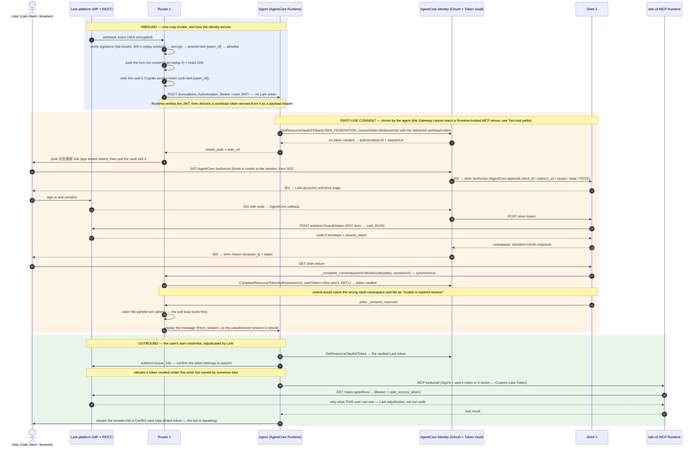
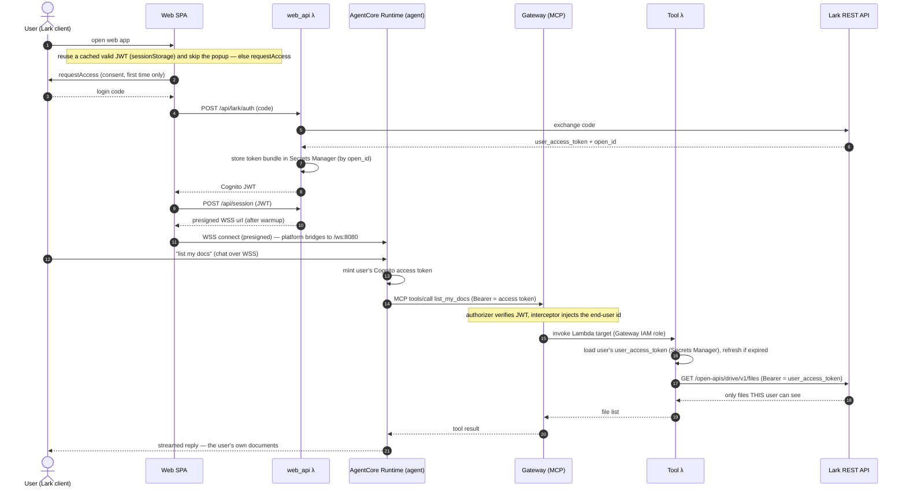

# Architecture

This is a reference implementation of **enterprise identity on Amazon Bedrock AgentCore, with Lark (Feishu) as the identity provider**. It demonstrates two things that are usually hard to get right: forwarding the *authenticated end-user identity* to downstream MCP tools, and inheriting that user's *actual permissions* so a tool can only reach what the user themselves can reach — the upstream system (Lark) adjudicates, we do not build a parallel access-control layer.

## The one idea

Every entrypoint resolves to the same stable identity `lark:{open_id}`, and that identity travels all the way to the tools — first as *who you are* (authentication), then as *what you can do* (authorization, via the user's own Lark token). The agent never holds a downstream credential.

## Components

| Component | What it is | Where |
|---|---|---|
| Router Lambda | Lark webhook ingestion (verify + AES decrypt, resolve user, invoke runtime); owns both session ids; handles the chat commands | `lambda/router/` |
| Agent container | Strands agent on Bedrock; HTTP contract (8080); AgentCore Memory for continuity; agent-side 3LO; MCP clients to the lark-cli server, the approval server when deployed, and optionally web search; runs turns in the background and posts answers to the chat itself | `agent/` |
| Lark OAuth shim | RFC-6749 façade over Lark's non-standard token endpoint, plus the 3LO return endpoint (`CompleteResourceTokenAuth`, then DMs the user) | `lambda/shim/` |
| Lark MCP server | lark-cli engine on AgentCore Runtime; calls Lark with the per-user token from a custom passthrough header | `mcp-servers/lark-cli/` |
| Approval MCP server | Lark approvals on AgentCore Runtime — the case where the user's identity *cannot* be forwarded: every decision endpoint takes only the app's tenant token, with a `user_id` naming whose record it becomes. Limits are enforced in code, not by the model | `mcp-servers/approval/` |
| AgentCore Identity | Token Vault: stores, refreshes and returns each user's Lark token (`USER_FEDERATION`), one OAuth provider per downstream system | provider `lark-agent-3lo`, workload `lark-agent-wl` |
| AgentCore Memory | Per-user conversation history, keyed by `(actor_id, memory_session_id)` | `lark_agent_agent_mem` (STM) |
| Cognito user pool | Token factory: mints a standard OIDC JWT for a Lark-authenticated user (Lark is not standard OIDC) | `stacks/security_stack.py` |
| AgentCore Gateway | Fronts the built-in **Web Search** connector (us-east-1 only, so it's cross-region). Not on the Lark tool path here, because it cannot be: verified @2026-08-19 the Gateway does per-user 3LO for a `CustomOauth2` provider, but only into an addressable HTTPS downstream — never into a Runtime-hosted MCP server | `stacks/gateway_stack.py`, `deploy.sh gateway` |

## One entrypoint, one identity

> **Status (2026-08): chat-only, 3LO driven agent-side, inbound auth is `CUSTOM_JWT`.** There is no web UI, and the Lark tools don't go through the Gateway — the agent fetches each user's token from the Token Vault itself and calls the lark-cli MCP server directly. **That is required by the topology, not a preference:** verified @2026-08-19 the Gateway *does* perform per-user 3LO for a `CustomOauth2` provider, but it cannot deliver that token to an MCP server hosted on AgentCore Runtime (see [Two tool paths](#two-tool-paths-and-why)). The Gateway *is* used for web search, where there's no user identity to forward. The inbound hop router → Runtime carries a **signed per-user JWT**; see [Inbound identity](#inbound-identity-a-signed-jwt-and-what-that-does-and-does-not-buy). Sections marked *(legacy)* describe the interceptor/web-UI baseline of the sibling variant and are kept for contrast.

```
                    ┌──────────────────────────────┐        ┌──────────────────────────┐
  Lark message ───▶ │  Router Lambda               │◀──────▶│  DynamoDB identity table │
   (webhook)        │  verify / AES-decrypt        │        │  SESSION    → runtime id │
                    │  resolve → lark:{open_id}    │        │  MEMSESSION → memory id  │
                    │  chat commands (/auth …)     │        │  ALLOW      → allowlist  │
                    └──────────────┬───────────────┘        └──────────────────────────┘
                     POST /invocations, Authorization: Bearer <user's JWT>
                     — returns "accepted" at once; carries runtimeSessionId +
                       memorySessionId + actorId + chatId
                     the Runtime verifies the JWT and derives the workload token
                       from it → see "Inbound identity" below
                                   ▼
        ┌────────────────────────────────────────────────────────┐
        │  Agent container (ARM64, AgentCore Runtime)            │     AgentCore Identity
        │   Strands agent, history in AgentCore Memory           │     Token Vault (3LO)
        │   lark_3lo: platform WAT → GetResourceOauth2Token      │◀───▶ stores / refreshes
        │   the turn runs in the background; /ping = HealthyBusy │     THIS user's token
        └───┬───────────────────────────────────────────┬────────┘            ▲
            │ MCP over SigV4, user's Lark token         │ answer, when ready  │ RFC-6749
            │ in X-Amzn-…-Custom-Lark-Token             │ (tenant token)      │
            ▼                                           │         ┌───────────┴───────────┐
    ┌──────────────────────────────┐                    │         │  Lark OAuth shim      │
    │  Lark MCP server (lark-cli)  │                    │         │  form ⇄ JSON,         │
    │  runs lark-cli AS the user   │                    │         │  code≠0 → 4xx         │
    └──────────────┬───────────────┘                    │         │  /return: complete +  │
         Authorization: Bearer                          │         │  DM the user          │
                   ▼                                    ▼         └───────────┬───────────┘
              Lark REST API ◀─────────────────────────────────────────────────┘
              → only what THIS user can see. Lark adjudicates.       consent
```

Identity is `lark:{open_id}` for every message, and the vaulted Lark token is keyed by it — so it survives any session change. The two session ids are separate on purpose (see [Conversation memory](#conversation-memory)): the runtime one picks the microVM, the memory one picks the history thread.

First use (consent-wait): no vaulted token → the router posts a clickable 点击授权 link, holds while polling the vault, and re-invokes once consent lands, so the user gets their answer without re-sending. The shim also DMs them when consent completes, which matters for `/auth`-triggered re-consent — there the old token is still present, so polling cannot tell the difference.

Answers come back asynchronously. A turn that researches something and writes it into a document outlasts any request/response window — `InvokeAgentRuntime` and the router's Lambda both cap out — and being cut off mid-way is the worst case, since the work often finished while the user was told it failed. So `chat_async` accepts the turn, returns at once, and runs it on a background thread. The reply is streamed rather than posted in one go: a CardKit card with `streaming_mode` goes out immediately as a placeholder, then the accumulated text is written into it so it types out. The write happens on the card's own thread and coalesces to the newest text — a CardKit write costs ~470 ms (measured, 361–606 ms), so doing it inline stalled the loop for longer than the interval it was throttled to, and the text arrived in jerks. Now the token loop is paced by the model (~40 chars/s measured for Sonnet 4.6) and the visible cadence by Lark's round trip, instead of the two throttling each other. What the placeholder actually covers is session assembly, not model latency: raw Bedrock returns a first token in 1.0–1.5 s, while a first turn spends ~7 s before that — ~4 s of MCP handshakes across two servers and ~2 s loading Memory history. Subsequent turns in the same session skip the handshake (the agent and its MCP clients are cached). All of this uses the app's tenant token: it is the bot speaking. A CardKit failure (missing `cardkit:card:write`, an update rejected mid-stream) degrades to a single plain-text post. `/ping` reports `HealthyBusy` for the duration, which is what stops AgentCore from reclaiming the container mid-turn; that defers idle reclamation (the session-inactivity timer `idleRuntimeSessionTimeout`) but not `maxLifetime` — the microVM's wall-clock age cap (default 8 h, configurable 60–28800 s) which never resets on activity, so it is the hard ceiling on one background turn. The router's async self-invocation also disables Lambda's default retries — a timeout counts as a function error there, so retries would replay the whole turn and duplicate both the work and the reply.

## Why Lark is wrapped in Cognito *(the web-UI exchange is legacy; the pool itself is still used)*

Lark is **not** a standard OIDC provider (no `id_token`, no discovery endpoint), so its login can't be plugged straight into a JWT authorizer. The sibling variant's `web_api` exchanged a Lark login code for a Cognito JWT (username = `lark:{open_id}`) to authenticate its web UI — that path is gone here.

The pool still earns its place, though: the search Gateway's `customJWTAuthorizer` needs a JWT, and `agent/identity.py` mints one per user on demand (`AdminInitiateAuth` with an HMAC-derived password, so nothing is user-chosen). It must be the **access** token — the Gateway validates the `client_id` claim, which only access tokens carry; an ID token 403s with `insufficient_scope`.

## The Gateway → Lark path (a common point of confusion) *(legacy — no Gateway on this variant's tool path)*

The Gateway does **not** talk to Lark directly. Its target is a **Lambda**. The chain is:

```
agent  ──MCP──▶  AgentCore Gateway  ──invoke (IAM)──▶  Tool Lambda  ──HTTPS/Bearer──▶  Lark REST API
       (client)   (MCP server, ours)                   (list_my_docs)  (user_access_token)  (Feishu, not MCP)
```

Lark is a plain REST API at the bottom, not an MCP server. The Lambda target exists because "look up this user's token, refresh it if expired, then call Lark" is per-user logic that needs somewhere to run — an OpenAPI target pointed straight at Lark couldn't manage per-user tokens.

## Auth at every hop, grouped by direction

Inbound and outbound are **independent axes** — each can be configured without regard to the other, and conflating them is where most of the confusion about AgentCore auth comes from. So the hops are listed by direction rather than in call order.

**Inbound — who is allowed to invoke us, and how the identity arrives:**

| Hop | Credential | Who verifies | Identity carried how |
|---|---|---|---|
| Lark → Router (webhook) | `X-Lark-Signature` + AES (encryptKey) | Router, fail-closed | `open_id` inside the decrypted event |
| Router → agent Runtime | the user's Cognito **access** token (Bearer) | AgentCore Runtime's `customJWTAuthorizer` (signature + `allowedClients`) | the token's `sub`; the platform derives a workload access token from it and delivers it as a payload header |
| Agent → lark-cli / approval Runtime | IAM SigV4 | AgentCore | n/a — the user's token rides a header (outbound concern) |

`actorId` is still in the payload, but it is now only a label for logs and Memory — the identity that decides *whose* token is fetched comes from the verified JWT, not from anything the payload asserts. See [Inbound identity](#inbound-identity-a-signed-jwt-and-what-that-does-and-does-not-buy).

**Outbound — what credential leaves us, and who adjudicates access:**

| Hop | Credential | Who adjudicates |
|---|---|---|
| Agent → AgentCore Identity | the workload access token the Runtime delivered (derived from the inbound JWT) | AgentCore Identity |
| Agent → lark-cli Runtime | the user's Lark token in `X-Amzn-…-Custom-Lark-Token` | passed through; lark-cli uses it verbatim |
| lark-cli → Lark REST | the user's **`user_access_token`** (Bearer) | **Lark** — returns only what that user can see |
| approval server → Lark REST | the **app's** tenant token + a `user_id` argument | Lark checks task ownership, never consent (see [approvals](#a-third-path-approvals-where-the-users-identity-cannot-be-passed-through)) |
| Agent → Web Search Gateway | the user's Cognito **access** token (Bearer) | Gateway `customJWTAuthorizer` (`allowedClients` checks the `client_id` claim, which ID tokens lack — an ID token 403s with `insufficient_scope`) |
| Gateway → Web Search connector | `GATEWAY_IAM_ROLE` | IAM |
| Agent / Router → Lark chat | the app's tenant token | Lark — it is the bot speaking, not the user |

The last row is the pair worth holding onto: **replies go out as the app, tool calls go out as the user.** Both directions exist in the same turn, on purpose.

*(Legacy, for contrast with the sibling interceptor variant: Browser → `web_api /api/session` used a Cognito JWT on an API Gateway authorizer; Browser → Runtime used a SigV4 **presigned** WSS URL; Gateway → Tool Lambda used the Gateway IAM role with a Lambda resource policy. None of those hops exist here.)*

## Inbound identity: a signed JWT, and what that does and does not buy

Everything above is about the *outbound* hop — the user's own token reaching Lark, so Lark adjudicates. This section is the inbound hop, router → Runtime, which decides something different: **whose** token the agent is able to fetch at all.

**What it does.** The router mints a per-user Cognito access token (`sub` = `lark:{open_id}`, `lambda/router/cognito.py`) and invokes the Runtime over HTTPS with it as a Bearer. The Runtime's `customJWTAuthorizer` verifies the signature and `allowedClients`, then hands the container a workload access token derived from that identity, in a payload header. The agent uses what it was given; it never names a user, so there is nothing for it to substitute.

```
  router ──signs a user JWT──▶ Runtime          agent: uses the delivered workload token
     Authorization: Bearer <sub=lark:ou_A>         ↑ cannot choose someone else, and
                  │                                 GetWorkloadAccessTokenFor{UserId,JWT}
                  ▼                                 is explicitly DENIED on its role
  Runtime verifies → derives workload token
     delivered as a payload header
```

Three details worth keeping, each measured rather than assumed:

- **Three header aliases carry the same workload token** — `x-amzn-bedrock-agentcore-runtime-workload-accesstoken`, `x-amz-bedrock-agentcore-identity-wat`, `workloadaccesstoken`. `agent/server.py` reads them in that order.
- **`CUSTOM_JWT` and SigV4 are mutually exclusive, with a clear error.** SigV4 against this Runtime now returns `AccessDeniedException: Authorization method mismatch`, which is why the router change and the authorizer change are one cutover, not two.
- **Not calling the by-name APIs is not a constraint; IAM is.** The execution role carries an explicit `Deny` on `GetWorkloadAccessTokenForUserId` *and* `GetWorkloadAccessTokenForJWT` (`stacks/agentcore_stack.py`). ForJWT is denied too because holding any user's JWT is by itself enough to exchange for their vaulted token. Verified with `iam simulate-principal-policy`: both come back `explicitDeny`.

**Consent completion moved with it.** The vault namespace follows the token's `sub`, so a consent started from a JWT-derived workload token can only be completed by naming the user with their signed token: `userIdentifier={"userToken": …}`, not `{"userId": …}`. Passing the string fails with `AccessDeniedException: Invalid or expired session` — which reads like a timing problem and is really a namespace mismatch. Because only the router mints user JWTs, the shim's `/return` delegates completion to it synchronously (`_complete_consent`) rather than holding the password salt itself.

**What it does not buy.** Two things are unchanged, and calling them out matters more than the win:

1. **Trust is relocated, not removed.** In the event-driven approval flow nobody is present, so the router signs a JWT for an absent person — "the app asserts it represents X" again, with the router as the asserting party instead of the agent. This is a real improvement, because the router is small, runs no model and never touches untrusted input, which the agent cannot claim. It is not the same as proof. Only OBO (`TOKEN_EXCHANGE`) makes impersonation cryptographically impossible, and it needs an inbound user token to exchange — a Lark bot entrypoint carries none, so it does not apply here at all (see `docs/agentcore-behavior.md`).
2. **A prompt-injected agent can still misuse the tools it has**, within that one user's own permissions. What closed is credential theft and impersonation, not over-broad action. That needs action-layer limits in code — which is what the approval server does (allowlist, amount ceiling, must hold the user's own grant), rather than leaving it to the model.

**Migration cost, if you are moving an existing deployment.** `ForUserId` and JWT-derived vault keys are separate namespaces (measured both directions: the same real user's token was retrievable ForUserId and absent ForJWT). Existing grants are not inherited and nothing errors — users are simply asked to consent once more. Budget that window.

## Identity pass-through vs permission inheritance

- **Identity pass-through** (authentication): the router resolves every message to `lark:{open_id}` and the agent fetches *that* user's token from the vault. The tool learns who is calling, while the agent itself holds no downstream credential.
- **Permission inheritance** (authorization): the MCP server calls Lark with that user's `user_access_token`, so Lark returns only what the user can see. Access is decided by Lark, not by our code. This is the stronger property: even a prompt-injected agent reaches only the user's own data, and only within the scopes they consented to (`drive:drive`, `docx:document`).

Authorization is scoped per downstream system, not per bot: each one gets its own OAuth credential provider, and the vault keys tokens by `(provider, userId)`. The router carries that mapping in `IDP_REGISTRY` (written by `scripts/setup-3lo.sh`), which is what lets `/auth` report status per IdP and `/auth <idp>` re-consent just one of them. Adding a downstream system means registering a provider and appending a registry entry — see `docs/native-3lo-builtin-vendor.md`.

## Two tool paths, and why

| | Lark tools | Web search |
|---|---|---|
| Needs the end user's identity | yes — it reads *their* documents | no — it queries Amazon's web index |
| How the agent reaches it | direct to the lark-cli Runtime (SigV4 + the user's token in a custom header) | through an AgentCore Gateway (MCP) |
| Outbound credential | the user's vaulted Lark token | `GATEWAY_IAM_ROLE` |

The split is a choice, and the reason recorded here for two months was wrong. Verified @2026-08-19,
the Gateway **does** perform per-user 3LO for a `CustomOauth2` provider like Lark: a `tools/call`
returns a `-32042` elicitation with an authorization URL, and after the user consents the retry
comes back with that user's own Lark data — the Gateway fetched the token and injected
`Authorization: Bearer` itself, with the agent never seeing it. What had blocked every earlier
attempt was the **gateway execution role**, which needs both
`bedrock-agentcore:GetResourceOauth2Token` / `GetWorkloadAccessToken*` and
`secretsmanager:GetSecretValue` on `bedrock-agentcore-identity!default/oauth2/*` (fetching reads
the provider's managed secret as the caller). Missing either returns one opaque string,
`An internal error occurred. Please retry later.`, which reads like a missing feature.

So the Lark tools stay on the direct path because that is what is built and measured here, not
because the Gateway cannot carry them. One caveat if you migrate: `ForUserId` and JWT-derived
vault keys are separate namespaces, so existing consents are **not** inherited and every user
re-authorises once — silently, as repeated consent prompts. See `docs/agentcore-behavior.md` for
the permission matrix and the rest. Web search needs none of this: with no user identity to
forward, `GATEWAY_IAM_ROLE` is all it needs, so it uses the Gateway as intended.

The Web Search connector is only offered in **us-east-1**, so its gateway lives there even
when the rest of the stack doesn't, and the agent calls it cross-region. Inbound auth is a
Cognito **access** token (the Gateway validates the `client_id` claim, which ID tokens lack) —
this is what the Cognito user pool is for on this variant. Two IAM actions are required:
`InvokeGateway` on the gateway, and `InvokeWebSearch` on `…:aws:tool/web-search.v1`, whose
account segment is the literal `aws`, not yours. Search is optional: `WEB_SEARCH=false` skips
the gateway entirely, and the agent simply runs without that tool.

## A third path: approvals, where the user's identity *cannot* be passed through

Everything above rests on one property — the downstream call carries the user's own token, so Lark decides what it may reach. Lark's approval API breaks that property, and the approval demo exists to show what you do when it happens.

`tasks/approve`, `reject`, `transfer` and `rollback` accept **only a tenant (app) token**; there is no user-token variant. `tasks/query` is the same. Only `add_sign` takes a user token — and even that one is out of reach here: Lark offers `approval:approval:readonly` as a user-token scope but no user-token *write* scope for approvals, while add_sign writes. So the user-identity path this whole document is about admits exactly one approval operation, and not one that can actually be performed. So a decision cannot be made *as* the user — it is made by the app, and a `user_id` argument says whose name to record it under:

| | Value | What it decides |
|---|---|---|
| `Authorization: Bearer` | the **app's** tenant token | that the app may operate approvals |
| `user_id` argument | the approver's `open_id` | **whose name the decision is recorded under** |

Lark verifies that `user_id` owns the task. It never asks whether that person agreed — there is nothing in the request that could represent them. So the approval record means "an authorised app claims to have decided for X", not "X decided". **The record itself cannot tell the two apart**, which is why every automated decision carries an `[AI 自动处理]` comment: that marker is the only thing an audit can key on afterwards.

Worse, the `user_id` is free: the app already knows every relevant `open_id` without anyone's consent (a webhook hands over its sender's; `tasks/query` returns each approver's). So Lark's ownership check is not a barrier — the `task_id` and its `user_id` are read together, and filling it in correctly is the only natural thing to do.

### What the guards actually are

Since the protocol offers no enforcement point, the limits live in the approval MCP server, in code rather than in the prompt (`mcp-servers/approval/server.js`, tested in `test_guards.mjs`):

- **An allow-list of approval definitions** (`AGENT_DECIDE_APPROVAL_CODES`) and an **amount ceiling** (`AGENT_DECIDE_MAX_AMOUNT`). Empty allow-list decides nothing — fail closed, so the demo is inert until switched on deliberately. `0` is a kill switch.
- **The approver's own grant must be on record.** The agent holds a vaulted token for everyone who ever consented, so "a token was passed" and "this approver consented" are different questions: the token is resolved to its owner (`authen/v1/user_info`) and compared with `user_id`. A mismatch refuses; an identity that can't be established refuses too.

Both are **self-imposed**. Lark would permit every decision they block. And they do not survive a leaked `appSecret`, which bypasses this server entirely — the agent itself holds that secret (it needs it to send messages), so the honest description is that these guards raise the bar from "knows a task_id" to "has compromised the app", without changing the trust model. A production design would split messaging and approvals into two Lark apps so the agent only holds the former's secret; this sample does not, to keep one app to configure.

### Event-driven: a turn with nobody present

The demo runs unattended — a `approval_task` event wakes a turn, so nobody has to ask. Delivery is scoped by subscription: Lark sends approval events only for definitions subscribed through `approvals/{code}/subscribe`, which is a **separate step from ticking the event in the console** (`./deploy.sh approvals`).

```
approval_task (PENDING, carries open_id + task_id + instance_code)
   ↓  router: three gates, then hand over the address
   │    status must be PENDING      — a settled status is the agent's own decision echoing back
   │    claim the task_id           — conditional put; Lark redelivers until acked, and the
   │                                  ack goes out long before the agent has decided
   │    approver must be allowlisted — otherwise silence; their approval is their own business
   ↓  invoke_agent(chat_async, chatId=open_id)   ← returns at once, address only
agent: reads the instance, applies the guards, decides, and posts its own reply
   ↓  StreamingCard(open_id) → im/v1/messages
the approver's DM
```

Two details that are easy to get wrong. **The router does not deliver the answer** — it only resolves the address; the agent posts the card itself, because the reply streams and a Lambda cannot stay alive for it. The router sends only the consent link and error fallbacks. And **an approval event carries no chat**, so the address is a person, not a room: both senders read an `ou_` prefix as "DM this person".

If the approver has never consented, the turn is guaranteed to wall (the guard above). So it is parked before dispatch and replayed by consent-resume after they authorize — an unattended turn has no user to re-send it.

Two Lark naming inconsistencies cost an afternoon each: the event calls it `approval_code` while `tasks/query` returns `definition_code`, and `tasks/query` is a **GET** (POST answers `404 page not found`, which reads like a permissions problem).

## Conversation memory

The agent is a Strands agent with an `AgentCoreMemorySessionManager` (STM) keyed by `(actor_id, memory_session_id)`. History lives in AgentCore Memory (30-day retention), so it outlives the microVM: a fresh container still reads the same thread. Per-session `(agent, MCP client)` are cached and reused across messages — rebuilding per message re-handshakes MCP and re-lists tools, ~15–20s of avoidable latency.

### Two session ids, deliberately separate

| Id | Decides | Owned by | Stored |
|---|---|---|---|
| **runtime session id** | which microVM serves the request (AgentCore binds them 1:1, but the binding is not permanent — the microVM is replaced on idle/lifetime limits while the id lives on) | router | DynamoDB `USER#{id} / SESSION` |
| **memory session id** | which conversation thread the agent reads and appends to | router, passed to the agent as `memorySessionId` | DynamoDB `USER#{id} / MEMSESSION` |

Keeping them apart is what makes the three chat commands possible — rotating an id is instant and non-destructive, so each command just switches ids rather than deleting anything:

- `/reset` → new memory thread, same instance (start over, old events kept)
- `/reconnect` → new instance, same memory thread (proves memory outlives the container)
- `/new` → both (a genuinely fresh start)
- `/clear` → deletes the current thread's events (the only destructive one)

Earlier the agent derived the memory id from `actor_id` itself and ignored what the router sent, which welded the two dimensions together: switching instances could never start a new thread, and the router's own reads of the thread always missed. Message counts come from `ListEvents` filtered to `conversational` payloads — Strands also writes session/agent state events, which would otherwise inflate the number.

Authorization is a third, orthogonal dimension: the vaulted Lark token is keyed to `lark:{open_id}`, not to either session, so rotating sessions never forces a re-consent.

## Sequence: first use — consent, then the user's own documents

The whole chain for a user who has never authorized, which is the case that exercises every hop. Inbound and outbound are boxed separately, because which credential applies depends on the direction and nothing else.



Two things the boxes are meant to make obvious. The **user's credential never appears inbound** — it is fetched, per user, on the outbound side; the inbound hop carries only a name. And the **last arrow flips identity**: the answer goes out as the app, while everything that touched the user's data went out as the user.

## Sequence: a web-UI turn that reads the user's docs 
> *(legacy — no web UI; see the consent-wait flow above)*



## Deploy shape

CDK stacks: security, agentcore, router, shim, gateway, observability. On this variant the tool path is agent-side 3LO, so the gateway stack is reduced to its service role (no mcpServer target); the shim stack (Lark OAuth RFC-6749 façade + 3LO return-url) is what the 3LO flow actually uses. Everything AgentCore-side is created outside CloudFormation: the **Runtimes** (agent, lark-cli MCP server, and the approval MCP server when deployed), Memory, the OAuth2 credential provider, the workload identity, and the Web Search gateway. `deploy.sh` builds them — ARM64 images via CodeBuild, resources via the AgentCore CLI / control-plane — and feeds ids back through `.cdk-state.json`. `AWS::BedrockAgentCore::*` types do now exist, so this is a choice rather than a limitation: the agent Runtime and Memory are created implicitly by `agentcore deploy`, which also builds the image, and replacing that official tool to move them into a stack costs more than it returns. Two consequences worth knowing: `destroy.sh` needs an explicit delete for each of these (nothing errors if one is missed — only a real teardown catches it), and the ordering `3lo`/`gateway` → `runtime` has to be maintained by hand, since the Runtime bakes in the provider name and gateway URL. See `README.md` for the deploy commands and Lark console setup.
