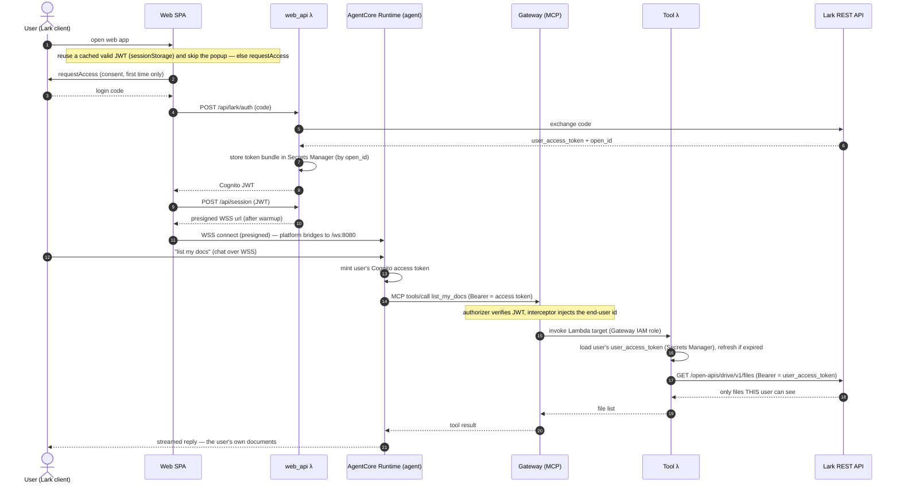

# Architecture

This is a reference implementation of **enterprise identity on Amazon Bedrock AgentCore, with Lark (Feishu) as the identity provider**. It demonstrates two things that are usually hard to get right: forwarding the *authenticated end-user identity* to downstream MCP tools, and inheriting that user's *actual permissions* so a tool can only reach what the user themselves can reach — the upstream system (Lark) adjudicates, we do not build a parallel access-control layer.

## The one idea

Every entrypoint resolves to the same stable identity `lark:{open_id}`, and that identity travels all the way to the tools — first as *who you are* (authentication), then as *what you can do* (authorization, via the user's own Lark token). The agent never holds a downstream credential.

## Components

| Component | What it is | Where |
|---|---|---|
| Router Lambda | Lark webhook ingestion (verify + AES decrypt, resolve user, invoke runtime); owns both session ids; handles the chat commands | `lambda/router/` |
| Agent container | Strands agent on Bedrock; HTTP contract (8080); AgentCore Memory for continuity; agent-side 3LO; MCP client to the lark-cli server; runs turns in the background and posts answers to the chat itself | `agent/` |
| Lark OAuth shim | RFC-6749 façade over Lark's non-standard token endpoint, plus the 3LO return endpoint (`CompleteResourceTokenAuth`, then DMs the user) | `lambda/shim/` |
| Lark MCP server | lark-cli engine on AgentCore Runtime; calls Lark with the per-user token from a custom passthrough header | `mcp-server/` |
| AgentCore Identity | Token Vault: stores, refreshes and returns each user's Lark token (`USER_FEDERATION`), one OAuth provider per downstream system | provider `lark-agent-3lo`, workload `lark-agent-wl` |
| AgentCore Memory | Per-user conversation history, keyed by `(actor_id, memory_session_id)` | `lark_agent_agent_mem` (STM) |
| Cognito user pool | Token factory: mints a standard OIDC JWT for a Lark-authenticated user (Lark is not standard OIDC) | `stacks/security_stack.py` |
| AgentCore Gateway | Provisioned but **not on this variant's tool path** — the Gateway can't do per-user 3LO for a CustomOauth2 provider | `stacks/gateway_stack.py` |

## One entrypoint, one identity

> **Status (2026-07): this variant is chat-only and drives 3LO agent-side.** There is no web UI and no Gateway on the tool path — the Gateway can't do per-user 3LO for a CustomOauth2 provider (AWS gap, agentcore-samples#1424), so the agent fetches each user's token from the Token Vault itself and calls a lark-cli MCP server directly. Sections marked *(legacy)* describe the interceptor/Gateway/web-UI baseline of the sibling variant and are kept for contrast.

```
                    ┌──────────────────────────────┐        ┌──────────────────────────┐
  Lark message ───▶ │  Router Lambda               │◀──────▶│  DynamoDB identity table │
   (webhook)        │  verify / AES-decrypt        │        │  SESSION    → runtime id │
                    │  resolve → lark:{open_id}    │        │  MEMSESSION → memory id  │
                    │  chat commands (/auth …)     │        │  ALLOW      → allowlist  │
                    └──────────────┬───────────────┘        └──────────────────────────┘
                     InvokeAgentRuntime (SigV4) — returns "accepted" at once;
                     carries runtimeSessionId + memorySessionId + actorId + chatId
                                   ▼
        ┌────────────────────────────────────────────────────────┐
        │  Agent container (ARM64, AgentCore Runtime)            │     AgentCore Identity
        │   Strands agent, history in AgentCore Memory           │     Token Vault (3LO)
        │   lark_3lo: GetResourceOauth2Token(USER_FEDERATION)    │◀───▶ stores / refreshes
        │   the turn runs in the background; /ping = HealthyBusy │     THIS user's token
        └───┬───────────────────────────────────────────┬────────┘            ▲
            │ MCP over SigV4, user's Lark token         │ answer, when ready  │ RFC-6749
            │ in X-Amzn-…-Custom-Lark-Token             │ (tenant token)      │
            ▼                                           │          ┌──────────┴────────────┐
    ┌──────────────────────────────┐                    │          │  Lark OAuth shim      │
    │  Lark MCP server (lark-cli)  │                    │          │  form ⇄ JSON,         │
    │  runs lark-cli AS the user   │                    │          │  code≠0 → 4xx         │
    └──────────────┬───────────────┘                    │          │  /return: complete +  │
         Authorization: Bearer                          │          │  DM the user          │
                   ▼                                    ▼          └──────────┬────────────┘
              Lark REST API ◀─────────────────────────────────────────────────┘
              → only what THIS user can see. Lark adjudicates.       consent
```

Identity is `lark:{open_id}` for every message, and the vaulted Lark token is keyed by it — so it survives any session change. The two session ids are separate on purpose (see [Conversation memory](#conversation-memory)): the runtime one picks the microVM, the memory one picks the history thread.

First use (consent-wait): no vaulted token → the router posts a clickable 点击授权 link, holds while polling the vault, and re-invokes once consent lands, so the user gets their answer without re-sending. The shim also DMs them when consent completes, which matters for `/auth`-triggered re-consent — there the old token is still present, so polling cannot tell the difference.

Answers come back asynchronously. A turn that researches something and writes it into a document outlasts any request/response window — `InvokeAgentRuntime` and the router's Lambda both cap out — and being cut off mid-way is the worst case, since the work often finished while the user was told it failed. So `chat_async` accepts the turn, returns at once, runs it on a background thread, and posts the result to the chat with the app's tenant token. `/ping` reports `HealthyBusy` for the duration, which is what stops AgentCore from reclaiming the container mid-turn; that defers idle reclamation but not the 8-hour instance ceiling. The router's async self-invocation also disables Lambda's default retries — a timeout counts as a function error there, so retries would replay the whole turn and duplicate both the work and the reply.

## Why Lark is wrapped in Cognito *(legacy — this variant has no Cognito/web UI)*

Lark is **not** a standard OIDC provider (no `id_token`, no discovery endpoint), so its login can't be plugged straight into an AgentCore/API-Gateway JWT authorizer. `web_api` performs a token exchange: Lark login code → Lark user info → Cognito `AdminCreateUser`/`AdminInitiateAuth` → a standard Cognito JWT (username = `lark:{open_id}`). Downstream, everything validates a normal Cognito JWT.

## The Gateway → Lark path (a common point of confusion) *(legacy — no Gateway on this variant's tool path)*

The Gateway does **not** talk to Lark directly. Its target is a **Lambda**. The chain is:

```
agent  ──MCP──▶  AgentCore Gateway  ──invoke (IAM)──▶  Tool Lambda  ──HTTPS/Bearer──▶  Lark REST API
       (client)   (MCP server, ours)                   (list_my_docs)  (user_access_token)  (Feishu, not MCP)
```

Lark is a plain REST API at the bottom, not an MCP server. The Lambda target exists because "look up this user's token, refresh it if expired, then call Lark" is per-user logic that needs somewhere to run — an OpenAPI target pointed straight at Lark couldn't manage per-user tokens.

## Auth at every hop *(legacy — the Gateway/Cognito/WSS hops don't exist on this variant)*

On this variant the hops are: Lark webhook → Router (signature+AES); Router → Runtime (IAM SigV4); Agent → lark-cli MCP Runtime (IAM SigV4 + user's Lark token in a custom passthrough header); lark-cli → Lark REST (Bearer = user_access_token, scoped by Lark to that user). The legacy table below describes the interceptor baseline.

| Hop | Credential | Who verifies |
|---|---|---|
| Lark webhook → Router | X-Lark-Signature + AES (encryptKey) | Router Lambda (fail-closed) |
| Browser → web_api `/api/session` | Cognito JWT | API Gateway JWT authorizer |
| Router / web_api → AgentCore Runtime | IAM SigV4 (`InvokeAgentRuntime`) | AgentCore |
| Browser → Runtime WSS | SigV4 **presigned URL** (signed by web_api) | AgentCore |
| Agent → Gateway (MCP) | user's Cognito **access** token (Bearer) | Gateway `customJWTAuthorizer` (validates `client_id` via `allowedClients`) |
| Gateway → Tool Lambda | Gateway IAM role | Lambda resource policy (principal `bedrock-agentcore`) |
| Tool Lambda → Lark REST | user's Lark **user_access_token** (Bearer) | Lark (scopes it to that user's own permissions) |

Note the deliberate split: the Runtime uses SigV4 inbound (so the webhook + web Lambdas can call it), while the *outbound* MCP path to the Gateway uses the per-user JWT. The Gateway needs the **access** token (it carries the `client_id` claim `allowedClients` checks); an ID token 403s with `insufficient_scope`.

## Identity pass-through vs permission inheritance

- **Identity pass-through** (authentication): the router resolves every message to `lark:{open_id}` and the agent fetches *that* user's token from the vault. The tool learns who is calling, while the agent itself holds no downstream credential.
- **Permission inheritance** (authorization): the MCP server calls Lark with that user's `user_access_token`, so Lark returns only what the user can see. Access is decided by Lark, not by our code. This is the stronger property: even a prompt-injected agent reaches only the user's own data, and only within the scopes they consented to (`drive:drive`, `docx:document`).

Authorization is scoped per downstream system, not per bot: each one gets its own OAuth credential provider, and the vault keys tokens by `(provider, userId)`. The router carries that mapping in `IDP_REGISTRY` (written by `scripts/setup-3lo.sh`), which is what lets `/auth` report status per IdP and `/auth <idp>` re-consent just one of them. Adding a downstream system means registering a provider and appending a registry entry — see `docs/native-3lo-builtin-vendor.md`.

## Conversation memory

The agent is a Strands agent with an `AgentCoreMemorySessionManager` (STM) keyed by `(actor_id, memory_session_id)`. History lives in AgentCore Memory (30-day retention), so it outlives the microVM: a fresh container still reads the same thread. Per-session `(agent, MCP client)` are cached and reused across messages — rebuilding per message re-handshakes MCP and re-lists tools, ~15–20s of avoidable latency.

### Two session ids, deliberately separate

| Id | Decides | Owned by | Stored |
|---|---|---|---|
| **runtime session id** | which microVM serves the request (AgentCore binds them 1:1) | router | DynamoDB `USER#{id} / SESSION` |
| **memory session id** | which conversation thread the agent reads and appends to | router, passed to the agent as `memorySessionId` | DynamoDB `USER#{id} / MEMSESSION` |

Keeping them apart is what makes the three chat commands possible — rotating an id is instant and non-destructive, so each command just switches ids rather than deleting anything:

- `/reset` → new memory thread, same instance (start over, old events kept)
- `/reconnect` → new instance, same memory thread (proves memory outlives the container)
- `/new` → both (a genuinely fresh start)
- `/clear` → deletes the current thread's events (the only destructive one)

Earlier the agent derived the memory id from `actor_id` itself and ignored what the router sent, which welded the two dimensions together: switching instances could never start a new thread, and the router's own reads of the thread always missed. Message counts come from `ListEvents` filtered to `conversational` payloads — Strands also writes session/agent state events, which would otherwise inflate the number.

Authorization is a third, orthogonal dimension: the vaulted Lark token is keyed to `lark:{open_id}`, not to either session, so rotating sessions never forces a re-consent.

## Sequence: a web-UI turn that reads the user's docs *(legacy — no web UI; see the consent-wait flow above)*



## Deploy shape

CDK stacks: security, agentcore, router, shim, gateway, observability. On this variant the tool path is agent-side 3LO, so the gateway stack is reduced to its service role (no mcpServer target); the shim stack (Lark OAuth RFC-6749 façade + 3LO return-url) is what the 3LO flow actually uses. Two AgentCore **Runtimes** (the agent and the lark-cli MCP server) have no CloudFormation resources in this region, so `scripts/deploy.sh` builds them out-of-band: ARM64 images via CodeBuild, runtimes created via the AgentCore CLI / control-plane; ids fed back into `cdk.json`. See `README.md` for the deploy commands and Lark console setup.
